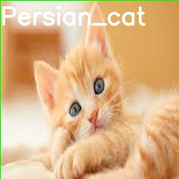

# recognize_API
This API can recognize pictures.  
画像認識用のAPIです。モデルは、vgg-16を使用しています。

## 概要
指定されたファイルをvgg-16のモデルで解析し、その結果と画像を返します。


## 入力と出力
Windowsでの入力例  
```
curl.exe -X POST http://127.0.0.1:5000/detect -H "Content-Type: application/json" -d '"{\"filename\":\"test.jpg\"}"'
```
この入力例では、test.jpgの内容をモデルに渡しています。  
標準出力には、```"persian_cat"```という出力が返ってきます。  

dataディレクトリのoriginalに猫の画像が入っています。  
<p align="center">
  
</p>

この画像を解析した結果が、dataのoutputに出力されます。  
<p align="center">
  
</p>

## 使い方
同一のディレクトリに、model.ptをダウンロードしてください。
